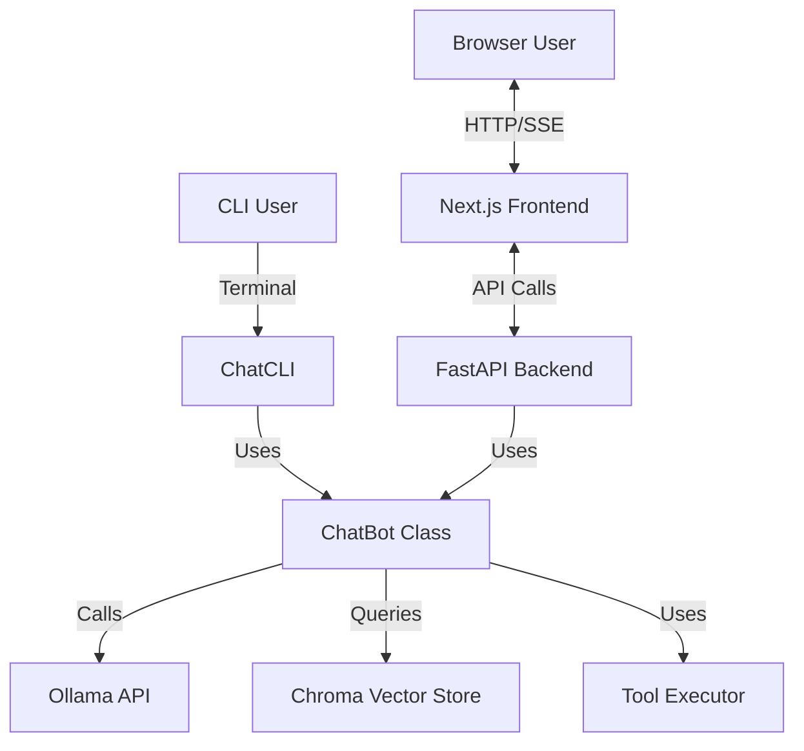

# Frontend Implementation Plan: Personal AI Local Dashboard

This document outlines the plan to build a modern, local-first frontend for the Personal AI Chatbot using Next.js 15, TypeScript, and shadcn/ui.

## 1. Architecture Overview

The project will support **two interfaces** sharing the same core logic:
1.  **CLI Interface (Existing)**: `main.py` → `ChatCLI` → `ChatBot` (unchanged)
2.  **Web Interface (New)**: Browser → Next.js Frontend → FastAPI API → `ChatBot`

Both interfaces use the **same `ChatBot` class**, ensuring feature parity. The CLI remains fully functional for terminal users.



### Key Design Principle
The `ChatBot` class will be **interface-agnostic**. It will support both:
- **Console mode**: Direct Rich console output (CLI)
- **Generator mode**: Yields structured events for API streaming (Web)

## 2. Tech Stack

### Frontend
-   **Framework**: Next.js 15 (App Router)
-   **Language**: TypeScript
-   **Styling**: Tailwind CSS v4
-   **UI Library**: shadcn/ui (Radix UI based)
-   **State Management**:
    -   **URL State**: `nuqs` (for shareable, bookmarkable UI state)
    -   **Global State**: `zustand` (for client-side UI preferences)
    -   **Server State**: `TanStack Query` (for API caching and optimistic updates)
-   **Animations**: `framer-motion` (for "Rolodex" cards and layout transitions)
-   **Layout**: `react-resizable-panels` (for IDE-like split views)

### Backend
-   **Server**: FastAPI (High performance, easy streaming support)
-   **Runtime**: Python 3.10+ (Existing environment)

## 3. Implementation Steps

### Phase 1: Backend API (`api.py`)

We need to expose the CLI functionality via HTTP while keeping the CLI working.

#### Core Refactor: `ChatBot` Generator Mode

**Critical**: The `ChatBot` class in `chat.py` must support two modes:

1. **Console Mode** (existing): Direct `rich.console` output for CLI
2. **Generator Mode** (new): Yields structured events for API streaming

Add a new method to `ChatBot`:

```python
def chat_stream(self, user_input: str) -> Generator[Dict[str, Any], None, None]:
    """Stream chat response as events instead of printing to console.
    
    Yields:
        Dict with keys: type, content, metadata
        - {"type": "token", "content": "hello"}
        - {"type": "thinking", "content": "reasoning..."}
        - {"type": "tool_call", "name": "web_search", "args": {...}}
        - {"type": "context_usage", "data": {...}}
    """
```

This allows the CLI to keep using `chat()` while the API uses `chat_stream()`.

#### API Endpoints (`api.py`)

1. **POST `/api/chat`**: 
   - Streaming endpoint using Server-Sent Events (SSE)
   - Accepts `{"message": str, "session_id": str}`
   - Calls `chatbot.chat_stream()` and streams events
   - Include `ContextUsage` in metadata

2. **GET `/api/config`**: Return current `ConfigManager` state
3. **POST `/api/config`**: Update config (model, tools_enabled, temperature, etc.)

4. **GET `/api/history`**: Return current session chat history
5. **GET `/api/history/{session_id}`**: Parse specific Markdown log from `chat_logs/`
6. **POST `/api/history/clear`**: Clear current session

7. **GET `/api/rag/status`**: Return RAG document count and collection info
8. **POST `/api/rag/search`**: Query vector DB directly
9. **POST `/api/rag/upload`**: Accept file upload, save temporarily, call `chatbot.rag_index_file()`

### Phase 2: Frontend Scaffolding (`frontend/`)

1.  **Initialize Next.js 15**:
    ```bash
    npx create-next-app@latest frontend --typescript --tailwind --eslint
    ```
2.  **Install Dependencies**:
    ```bash
    npm install framer-motion nuqs zustand @tanstack/react-query lucide-react clsx tailwind-merge react-resizable-panels
    ```
3.  **Setup shadcn/ui**:
    ```bash
    npx shadcn@latest init
    npx shadcn@latest add button card input scroll-area separator sheet sidebar skeleton slider switch tabs textarea tooltip resizable
    ```
4.  **Configure `nuqs`**:
    -   Wrap root layout with `NuqsAdapter`.

### Phase 3: Core Components

#### 1. The "Rolodex" (File/Card System)
-   **Concept**: A virtualized list of "cards" representing chat sessions or RAG documents.
-   **Tech**: `framer-motion` `layoutId`.
-   **Implementation**:
    -   List view of compact cards.
    -   Clicking a card expands it to fill the center view.
    -   Use `AnimatePresence` for smooth entry/exit.

#### 2. The "Reader" (Split View)
-   **Concept**: IDE-like layout for reading long content or analyzing RAG results.
-   **Tech**: `react-resizable-panels`.
-   **Implementation**:
    -   Left: Navigation/Chat list.
    -   Center: Main Chat/Content.
    -   Right: Context/Citations (Collapsible).
    -   Persist layout sizes in URL using `nuqs`.

#### 3. Chat Interface
-   **Concept**: Modern chat UI with streaming support.
-   **Tech**: `useChat` (custom hook using `fetch` and `ReadableStream`) or Vercel AI SDK (optional, but custom might be simpler for this specific backend).
-   **Features**:
    -   Markdown rendering (react-markdown).
    -   Code highlighting.
    -   "Thinking" accordion (collapsible reasoning steps).
    -   Tool call visualization (show what tools are being used).

### Phase 4: Integration

1. **Connect Frontend to Backend**:
   - Configure `next.config.ts` rewrites to proxy `/api` calls to `http://localhost:8000`.
   - Or use CORS in FastAPI.

2. **Real-time Updates**:
   - Ensure streaming responses are handled correctly in the UI.

### Phase 5: CLI/Frontend Coexistence

**Startup Options:**

```bash
# Option 1: CLI only (existing)
python main.py

# Option 2: API server only
python api.py

# Option 3: Both (recommended for development)
# Terminal 1:
python api.py
# Terminal 2:
cd frontend && npm run dev
```

**Shared Resources:**
- Both interfaces use the same `config.json`
- Both write to the same `chat_logs/` directory
- Both access the same ChromaDB instance

## 4. Directory Structure

```
personalAI/
├── api.py                  # New FastAPI backend
├── chat.py                 # Existing logic
├── ...
└── frontend/               # New Next.js project
    ├── app/
    │   ├── layout.tsx      # Root layout with Providers
    │   ├── page.tsx        # Main dashboard
    │   └── globals.css
    ├── components/
    │   ├── chat/
    │   │   ├── chat-input.tsx
    │   │   ├── message-list.tsx
    │   │   └── thinking-accordion.tsx
    │   ├── layout/
    │   │   ├── app-sidebar.tsx
    │   │   └── resizable-layout.tsx
    │   ├── rolodex/
    │   │   └── card-stack.tsx
    │   └── ui/             # shadcn components
    ├── lib/
    │   ├── api.ts          # API client
    │   ├── store.ts        # Zustand store
    │   └── utils.ts
    └── hooks/
        └── use-chat-stream.ts
```

## 5. Next Steps

1. **User Approval**: Confirm this plan.
2. **Backend**: Build `api.py` with streaming support.
3. **Frontend**: Initialize and build components.

## 6. Integration Specifics (Critical Requirements)

### Configuration Sync

**Problem**: CLI uses runtime commands (`/toggle-tools`, `/toggle-thinking`) that need UI equivalents.

**Solution**:
- Expose `ConfigManager` via GET/POST `/api/config`
- Build a Settings Sheet (shadcn Dialog) with:
  - Model selection dropdown (Ollama models + Gemini)
  - Toggle switches for: `tools_enabled`, `thinking_enabled`, `show_thinking`, `markdown_rendering`
  - Temperature slider (0.0 - 1.0)
  - Web search toggles: `web_search_enabled`, `auto_fetch_urls`
  
### Context Window Visualization

**Problem**: CLI shows color-coded progress bars (green/yellow/red) before each LLM call. This is critical UX.

**Solution**:
- Include `ContextUsage` object in every streaming response metadata:
  ```json
  {
    "type": "context_update",
    "data": {
      "current_tokens": 2500,
      "max_tokens": 32768,
      "percentage": 7.6,
      "status": "green"
    }
  }
  ```
- Frontend: Use shadcn `Progress` component in the sidebar/header
- Color logic (matching `models.py`):
  - Green: < 70%
  - Yellow: 70-85%
  - Red: > 85%

### RAG & Knowledge Base Management

**Problem**: CLI allows indexing files via `/rag-index <file>`. Frontend needs this capability.

**Solution**:
- **POST `/api/rag/upload`**: Accept multipart file upload (PDF/TXT/MD)
  - Save to temp directory
  - Call `chatbot.rag_index_file()`
  - Return chunk count
- **Frontend Component**: "Knowledge Base Manager" panel with:
  - Drag-and-drop zone (shadcn `DropZone`)
  - Document list showing indexed files
  - Status badges showing collection size
  - Search interface to test RAG retrieval

### Thinking Visualization

**Problem**: CLI shows thinking in a `[dim]` Rich console block. Web UI needs structured display.

**Solution**:
- Stream thinking separately: `{"type": "thinking", "content": "..."}`
- Frontend: Use shadcn `Accordion` component
  - Collapsed by default
  - Badge showing "Thinking" with token count
  - Expandable to show full reasoning

### Tool Call Visualization

**Problem**: CLI shows tool execution with colored output and progress indicators.

**Solution**:
- Stream tool events:
  ```json
  {"type": "tool_start", "name": "web_search", "args": {...}}
  {"type": "tool_result", "name": "web_search", "result": "..."}
  ```
- Frontend: Use shadcn `Card` components with:
  - Tool name badge
  - Loading spinner during execution
  - Collapsible result viewer

### Session Management

**Problem**: CLI stores sessions as Markdown files in `chat_logs/`. Frontend needs to read these.

**Solution**:
- **GET `/api/sessions`**: List all sessions from `SessionIndex`
- **GET `/api/sessions/{session_id}`**: Parse Markdown → JSON
  - Extract messages
  - Parse metadata (date, model, token counts)
- Frontend: "History" sidebar showing past sessions as cards

### URL Cache & Auto-Fetch

**Problem**: CLI caches fetched URLs in memory. This won't work across API calls.

**Solution**:
- Move `url_cache` to Redis or file-based cache (e.g., `diskcache`)
- Share cache between CLI and API
- Frontend: Show "Fetching..." badges when auto-fetch is triggered

## 7. Technical Constraints

### Streaming Architecture

Use **Server-Sent Events (SSE)** instead of WebSockets:
- Simpler to implement
- Better for one-way streaming
- Works with standard HTTP proxies

FastAPI SSE example:
```python
from fastapi.responses import StreamingResponse

@app.post("/api/chat")
async def chat_endpoint(message: str):
    async def event_generator():
        for event in chatbot.chat_stream(message):
            yield f"data: {json.dumps(event)}\n\n"
    
    return StreamingResponse(event_generator(), media_type="text/event-stream")
```

### CORS Configuration

Both CLI and frontend must work simultaneously:

```python
from fastapi.middleware.cors import CORSMiddleware

app.add_middleware(
    CORSMiddleware,
    allow_origins=["http://localhost:3000"],
    allow_credentials=True,
    allow_methods=["*"],
    allow_headers=["*"],
)
```

### Configuration Hot Reload

When config changes via API:
- Save to `config.json` (existing behavior)
- Broadcast config update event to all connected clients
- CLI picks up changes on next command (existing behavior)

## 8. Testing Strategy

### Phase 1: API Testing
- Test streaming with `curl`:
  ```bash
  curl -N http://localhost:8000/api/chat -d '{"message": "test"}'
  ```
- Verify tool execution streams events correctly
- Test config updates persist

### Phase 2: Frontend Integration
- Mock API responses first
- Test streaming connection
- Verify context bar updates in real-time

### Phase 3: End-to-End
- Test CLI and web UI running simultaneously
- Verify shared session history
- Test RAG indexing from both interfaces
